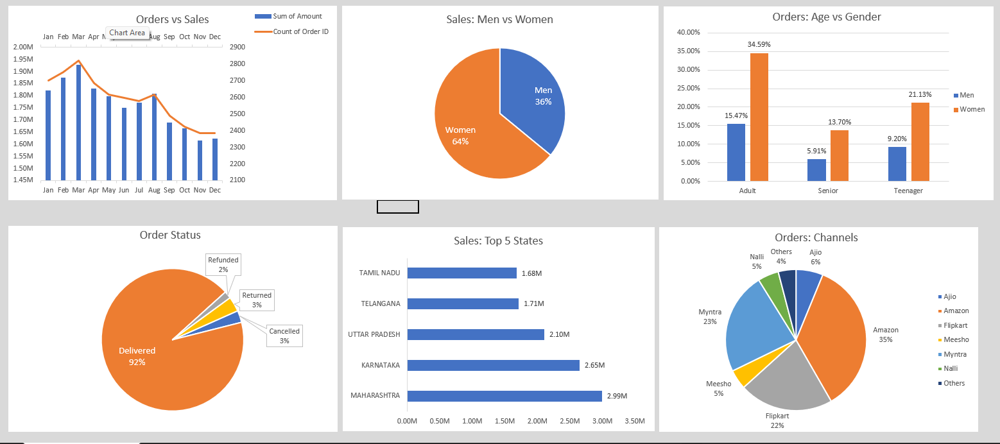

Vrinda Clothing Store Data Analysis Project
This project analyzes data from Vrinda Clothing Store to uncover patterns in sales, customer demographics, and order distribution. Six different charts have been created to visualize key insights, helping to understand the store's performance and customer base more effectively.

Project Overview
This data analysis project includes various charts and visualizations, each focusing on a specific aspect of Vrinda Clothing Store’s sales and customer data.

This analysis aims to provide Vrinda Clothing Store with actionable insights to drive strategic decisions in customer engagement, sales optimization, and operational efficiency.

